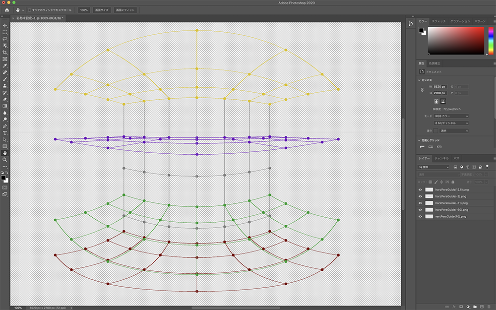

# perspective_grid_eqrect
正距円筒図法(Equirectangular)に則ったグリッド状の
“パースガイド”を計算して、画像生成します。

---
## 概要
全天球イラストを描く際に、
正距円筒図法に則ったパースガイド計算が必要になりますが、
このスクリプトはグリッド状のパースガイドを計算して、
PNG画像を生成・描画します。
PNG画像はパースガイド面以外は透過して生成しますので、
Photoshop等のペイントソフトにレイヤーとしてすぐに読み込めて
作画作業に入ることができます。  
下図は、「水平パースガイド生成」と「垂直パースガイド生成」の2つのスクリプト(初期値)で生成した画像をPhotoshopレイヤーで読み込んだスクリーンショットです。

このリポジトリでは「水平パースガイド生成」「垂直パースガイド生成(垂直面の傾斜角も指定可能)」
「円ガイド生成」「太陽光によってできる影(平行光源)計算」の4つの機能をスクリプトとして提供します。

---
## 動作環境(使用モジュール)
* Python 3.7.7
* numpy 1.18.3
* pillow 7.1.2

---
## 簡単な使い方

ご自身のローカル環境にPython実行環境を構築の上、このリポジトリを`clone`してください。

※拙著[「全天球イラストの描き方」](https://www.pixiv.net/user/810920/series/41910)
をまずはご覧頂き、用語や概念を理解した上で以下の使い方をお読みください。

[水平パースガイド生成](doc/setting_horz_plane_pers_grid.md)  
[垂直パースガイド生成](doc/setting_vert_plane_pers_grid.md)  
[円ガイド生成](doc/setting_circle_grid.md)  
[太陽光(平行光源)の影計算](doc/calc_directional_light.md)  

---

## 今後やること(確定はしていない)

### 中途半端なクラス実装をもうちっとなんとかする…
いかんせん、イラスト制作の時に必要に迫られてだだーっと作ったモノたちばかりなので、
プログラムの抽象化がほとんどなされていません。
後から作った「円ガイド生成」あたりになると、「これオブジェクトでまとめた方がラクじゃね？」という事に気付きクラス実装を始めてみましたが、最初に作った「水平&垂直パースガイド生成」のほうは置いてけぼりのままで、なんとも中途半端なことになってます・・・

---

## 免責事項
このプログラムはそもそも展開用に書いたものではないので、ちゃんとしたドキュメント等はありません(書く予定もありません)。従って、このREADMEおよび備忘録的に書いたソース内のコメントを頼りに、Pythonコードを解析できる人のみ利用してください。  
ライセンスはGPLに準拠します。利用の際は、作者は一切の責任(サポート等)を負わないものとします。  
もともと作者(わたなべ:mana544)が全天球イラスト制作用に個人的に描いた汎用性のないスクリプトなので、ソース(構造含む)が汚いのはご容赦を。合間見てちょぼちょぼ修正入れていきます。Fork大歓迎(誰か抽象化してクラスで書いてくれないかな…)

