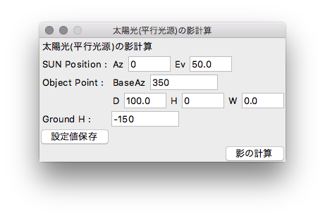
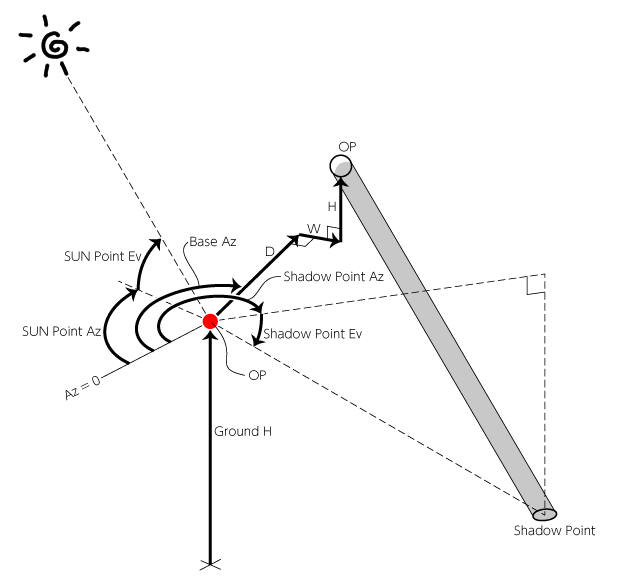
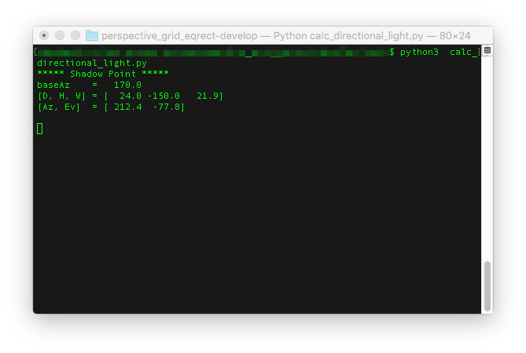

# 「太陽光(平行光源)の影計算」の使い方
太陽光(平行光源)によってできる、OPから地面に落ちる影の点(Shadow Point)を計算します。

## 準備
ご自身のローカル環境に以下の実行環境を構築の上、このリポジトリを`clone`してください。
* Python(Anaconda) 3.6.4(5.1.0)
* tkinter 8.6
* numpy 1.14.0

以降、拙著[「全天球イラストの描き方」](https://www.pixiv.net/user/810920/series/41910)
をまずはご覧頂き、用語や概念を理解した上で以下の使い方をお読みください。

## "calc_directional_light.py"を呼び出す
"calc_directional_light.py"を呼び出すと、
以下のようなGUI設定画面が立ち上がります。  

## 設定値の入力
設定値については、以下の概念図も併せてご覧下さい。  

| 名前 | format|説明|
|:---|:---|:---|
|SUN Position(Az, Ev) |float |太陽の方向をAz, Evで指定。|
|Object Point(BaseAz, D, H, W) |float |影計算の対象となるオブジェクトポイントをBaseAz, D, H, W|
|Ground H|float |SP～地面の高さ。SPより地面が下にある場合(普通はこの場合が多い)はマイナスで指定。|

### 設定値に関する注意事項
SUN PositionよりもOPのEvが上にあると、地面に影が落ちないのでエラーとなります。

## 影の計算
設定値を入力したら「影の計算」ボタンを押下すると、コマンドコンソール上にShadow Pointの計算結果(Az, Ev)を表示します。 

## 設定値の保存
「設定値保存」ボタンを押下すると、現在の設定値を保存することができます。
保存した設定値はGUI(設定画面)を閉じても保持され、次回起動時に自動的にロード・反映されます。  
設定値は「setting.json」に記録しています。設定値を初期化したい場合は、このリポジトリの「setting.json」を、ご自身のワーキングツリーに対して`fetch`した後に`checkout`すれば初期値にリセットされます。(別にローカルリポジトリ全体を`reset`してもいいけど)  
ただし、「setting.json」には他のパースガイド生成の設定値も共存してますので、そちらも一緒にリセットされてしまいます。
