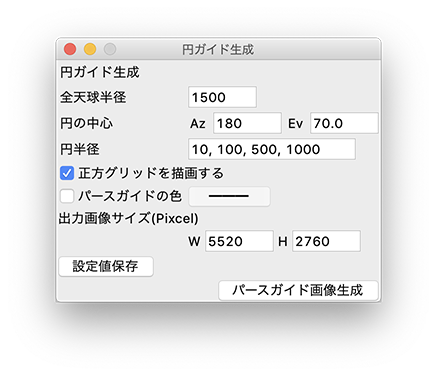
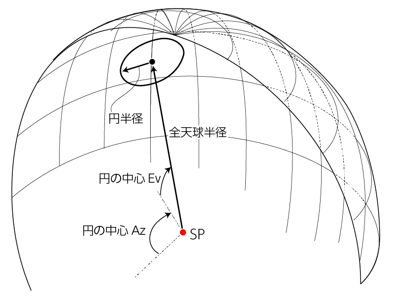

# 「円ガイド生成」の使い方
正距円筒図法(Equirectangular)に則った同心円の
“正円ガイド”を計算して、画像生成します。

以降、拙著[「全天球イラストの描き方」](https://www.pixiv.net/user/810920/series/41910)
をまずはご覧頂き、用語や概念を理解した上で以下の使い方をお読みください。

## "setting_circle_grid.py"を呼び出す
"setting_circle_grid.py"を呼び出すと、
以下のようなGUI設定画面が立ち上がります。


## 設定値の入力
設定値については、以下の概念図も併せてご覧下さい。  


### 全天球半径
全天球の半径。

#### 制約条件・注意点
* 正の値を指定してください。
* 単位は[mm]でも[cm]でも[m]でもなんでもいいですが、「円半径」と同じ単位に揃えて下さい。

### 円の中心(Az, Ev)
生成する円の中心を[Az, Ev]で指定。

#### 制約条件・注意点
* 0 <= Az < 360[deg]で指定してください。
* -90 <= Ev <= 90[deg]で指定してください。

### 円半径
生成する円の半径。この項目だけは複数の数値を入力することができて、カンマで区切って数値を指定すると、その数だけ円ガイドが同心円状に生成されます。ひとつだけ円ガイドを生成したい場合は、ひとつの数値を指定してください。

#### 制約条件・注意点
* 正の値を指定してください。
* 単位は[mm]でも[cm]でも[m]でもなんでもいいですが、「全天球半径」と同じ単位に揃えて下さい。

### 正方グリッドを描画する
PNG画像内に正距円筒図法の正方グリッドを描画するかどうか。チェックをいれると、Az=(0, 90, 180, 270, 360), Ev=(-90, 0, 90) の位置にグレーのラインが描画されます。

### パースガイドの色
パースガイドを任意の色にしたい場合、チェックを入れて右のボタンで色を指定してください。複数の同心円を生成する際も、円の色はこの1色で書き出されます。このチェックを入れない場合、円の色は自動で決定します。

### 出力画像サイズ
パースガイド出力画像サイズを ```W, H``` それぞれpicxelで指定。

#### 制約条件・注意点
* 正の整数で指定。
* 必ず縦横比が ```W:H = 2:1``` になるようなサイズを設定して下さい。
* このスクリプトでは画像の出力サイズに制限を設けていませんが、大きいサイズを指定すると計算に時間がかかり、場合によってはエラーになるかもしれません。

## パースガイド画像生成
設定値を入力したら「パースガイド画像生成」ボタンを押下すると、計算してPNG画像を生成します。  
保存場所はスクリプト実行時のカレントディレクトリ。保存ファイル名は「circlePersGuide.png」で決め打ち。同名ファイルが既にある場合は上書きしてしまうため、生成後は待避させましょう。

## 設定値の保存
「設定値保存」ボタンを押下すると、現在の設定値を保存することができます。
保存した設定値はGUI(設定画面)を閉じても保持され、次回起動時に自動的にロード・反映されます。  
設定値は「setting.json」に記録しています。設定値を初期化したい場合は、このリポジトリの「setting.json」を、ご自身のワーキングツリーに対して`fetch`した後に`checkout`すれば初期値にリセットされます。(別にローカルリポジトリ全体を`reset`してもいいけど)  
ただし、「setting.json」には他のパースガイド生成の設定値も共存してますので、そちらも一緒にリセットされてしまいます。

## 既知のバグ
Az = 0 = 360 をまたいで円の生成を行おうとすると、うまく描画できません。この場合は、Az = 180 で一度生成してから、Photoshopなどの画像編集ソフトで「スクロールフィルタ」などで加工をしてください。

