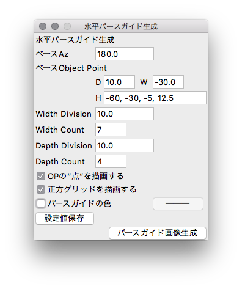
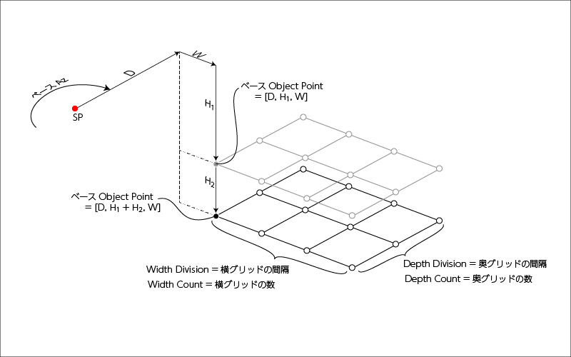

# 「水平パースガイド生成」の使い方

正距円筒図法(Equirectangular)に則ったグリッド状の
“パースガイド”を計算して、画像生成します。

以降、拙著[「全天球イラストの描き方」](https://www.pixiv.net/user/810920/series/41910)
をまずはご覧頂き、用語や概念を理解した上で以下の使い方をお読みください。

## "setting_horz_plane_pers_grid.py"を呼び出す
"setting_horz_plane_pers_grid.py"を呼び出すと、
以下のようなGUI設定画面が立ち上がります。

## 設定値の入力
設定値については、以下の概念図も併せてご覧下さい。  

説明で頻繁に出てくる“ベースObject Point(Base OP)”とは、
パース面生成の基点となるOPのことで、図中の黒塗り潰しの点のことを指します。  

| 名前 | format| initial |説明|
|:---|:---|:---|:---|
|ベースAz |float |180.0 |Base OPが向いている方位角。0 <= ベースAz < 360[度]で指定。|
|D(ベースObject Point) |float |10.0 |SPからBase OPまでの前進距離。前進方向がプラス。D > 0 で指定のこと。|
|W(ベースObject Point) |float |-30.0 |SPからBase OPまでの、垂直面からの横方向の距離。右方向がプラス。左方向がマイナス。|
|H(ベースObject Point) |float(,　float...) |-60, -30, -5, 12.5|SPからBase OPまでの、水平面からの縦方向の距離。上方向がプラス。下方向がマイナス。この項目だけは複数の数値を入力することができて、カンマで区切って数値を指定すると、その数だけ水平面パースガイド(画像)が生成されます。ひとつだけパース面を生成したい場合は、ひとつの数値(高さ)を指定してください。|
|Width Division|float |10.0 |Base OPから横方向の格子点間隔。プラスだとSPから見て右方向に、マイナスだと左方向に生成。|
|Width Count|int|7 |横方向の格子点の数。正の整数で指定。必ず1以上を指定のこと。|
|Depth Division|float |10.0 |Base OPから奥行き方向の格子点間隔。プラスだとSPから見て奥方向に、マイナスだと手前方向に生成。だけど、D=0があると(SPと重なると)正接の計算ができないので基本はプラスに指定した方が無難です。|
|Depth Count|int|4|奥行き方向の格子点の数。正の整数で指定。必ず1以上を指定のこと。|
|出力画像サイズ|int|W: 5000, H: 2500|パースガイドの出力画像サイズを縦横それぞれpicxelで指定。正の整数で指定。必ず縦横比が「W:H = 2:1」になるようなサイズを設定して下さい。|

| 名前  |説明|
|:---|:---|
|OPの“点”を描画する|OPの“点”を描画するかどうか。通常はなくてもいい気がする。|
|正方グリッドを描画する|PNG画像内に正距円筒図法の正方グリッドを描画するかどうか。チェックをいれると、Az=(0, 90, 180, 270, 360), Ev=(-90, 0, 90) の位置にグレーのラインが描画されます。|
|パースガイドの色|パースガイドを任意の色にしたい場合、チェックを入れて右のボタンで色を指定してください。複数の水平パース面を生成する際も、パースガイドの色はこの1色で書き出されます。このチェックを入れない場合、パースガイドの色は自動で決定します。複数の水平パースを生成するときは、いろんな色で出力されるため、作画時の視認性が良いかと。|

## パースガイド画像生成
設定値を入力したら「パースガイド画像生成」ボタンを押下すると、水平パース面を計算してPNG画像を生成します。  
保存場所はスクリプト実行時のカレントディレクトリ。保存ファイル名は「horzPersGuide(00.0).png」で決め打ち(“00.0”はH(ベースObject Point)で設定した数値)。同名ファイルが既にある場合は上書きしてしまうため、生成後は待避させましょう。

## 設定値の保存
「設定値保存」ボタンを押下すると、現在の設定値を保存することができます。
保存した設定値はGUI(設定画面)を閉じても保持され、次回起動時に自動的にロード・反映されます。  
設定値は「setting.json」に記録しています。設定値を初期化したい場合は、このリポジトリの「setting.json」を、ご自身のワーキングツリーに対して`fetch`した後に`checkout`すれば初期値にリセットされます。(別にローカルリポジトリ全体を`reset`してもいいけど)  
ただし、「setting.json」には他のパースガイド生成の設定値も共存してますので、そちらも一緒にリセットされてしまいます。
