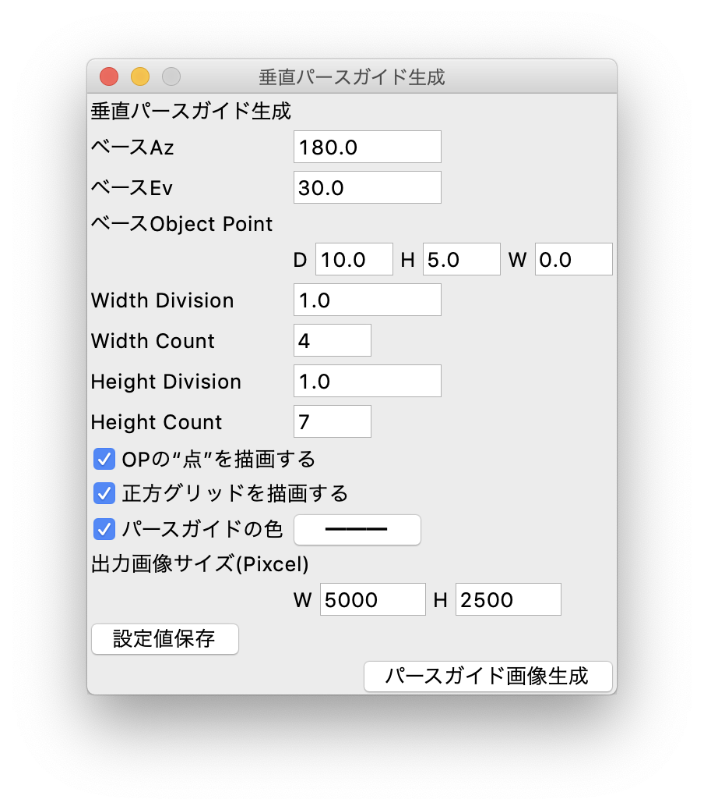
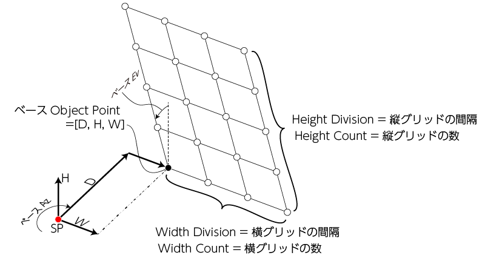

# 「垂直パースガイド生成」の使い方
正距円筒図法(Equirectangular)に則ったグリッド状の
“パースガイド”を計算して、画像生成します。

以降、拙著[「全天球イラストの描き方」](https://www.pixiv.net/user/810920/series/41910)
をまずはご覧頂き、用語や概念を理解した上で以下の使い方をお読みください。

## "setting_vert_plane_pers_grid.py"を呼び出す
"setting_vert_plane_pers_grid.py"を呼び出すと、
以下のようなGUI設定画面が立ち上がります。


## 設定値の入力
設定値については、以下の概念図も併せてご覧下さい。  


説明で頻繁に出てくる“ベースObject Point(Base OP)”とは、
パース面生成の基点となるOPのことで、図中の黒塗り潰しの点のことを指します。  

### ベースAz
Base OPが向いている方位角。

#### 制約条件・注意点
* 0 <= ベースAz < 360[deg]で指定。

### ベースEv
垂直パース面の前傾角。
垂直パース面を生成するには0.0を指定。
プラスに指定するとパース面がSP方向に傾きます。(図のベースEv矢印方向)

#### 制約条件・注意点
* -90.0 < ベースEv < 90.0[deg] で指定。
* ベースEvに0以外の値を設定するとき、つまり垂直パース面を傾ける場合、
  ベースEv、ベースObject Point、Height Division、Height Countの各設定値との関係によって、OPのD(奥行き) <= 0 となってしまうと、うまく計算ができません。  
  ベースEvを手前に大きく傾けるほどこの問題に直面しやすくなるので注意して下さい。

### ベースObject Point
SPからベースOPまでの距離を```[D, W, H]```で指定。

```D``` はSPからBase OPまでの前進距離。前進方向がプラス。  
```H``` はSPからBase OPまでの、水平面からの縦方向の距離。上方向がプラス。下方向がマイナス。  
```W``` はSPからBase OPまでの、垂直面からの横方向の距離。右方向がプラス。左方向がマイナス。

#### 制約条件・注意点
* D > 0 で指定のこと。```D``` にマイナスを入れたい場合はベースAzを180[deg]反転させた方向で生成するなどの工夫を。

### Width Division
Base OPから横方向の格子点間隔。プラスだとSPから見て右方向に、マイナスだと左方向に生成。

### Width Count
横方向の格子点の数。

#### 制約条件・注意点
* 正の整数で指定。
* 必ず1以上を指定のこと。

### Height Division
Base OPから高さ方向の格子点間隔。プラスだとSPから見て上方向に、マイナスだと下方向に生成。

### Height Count
高さ方向の格子点の数。

#### 制約条件・注意点
* 正の整数で指定。
* 必ず1以上を指定のこと。

### OPの“点”を描画する
OPの“点”を描画するかどうか。通常はなくてもいい気がする。

### 正方グリッドを描画する
PNG画像内に正距円筒図法の正方グリッドを描画するかどうか。
チェックをいれると、Az=(0, 90, 180, 270, 360), Ev=(-90, 0, 90) の位置にグレーのラインが描画されます。

### パースガイドの色
パースガイドを任意の色にしたい場合、チェックを入れて右のボタンで色を指定してください。複数の水平パース面を生成する際も、パースガイドの色はこの1色で書き出されます。  
このチェックを入れない場合、パースガイドの色は自動で決定します(赤っぽい色)。

### 出力画像サイズ
パースガイド出力画像サイズを ```W, H``` それぞれpicxelで指定。

#### 制約条件・注意点
* 正の整数で指定。
* 必ず縦横比が ```W:H = 2:1``` になるようなサイズを設定して下さい。
* このスクリプトでは画像の出力サイズに制限を設けていませんが、大きいサイズを指定すると計算に時間がかかり、場合によってはエラーになるかもしれません。

## パースガイド画像生成
設定値を入力したら「パースガイド画像生成」ボタンを押下すると、水平パース面を計算してPNG画像を生成します。  
保存場所はスクリプト実行時のカレントディレクトリ。保存ファイル名は「vertPersGuide(00.0).png」で決め打ち(“00.0”はD(ベースObject Point)で設定した数値)。同名ファイルが既にある場合は上書きしてしまうため、生成後は待避させましょう。

## 設定値の保存
「設定値保存」ボタンを押下すると、現在の設定値を保存することができます。
保存した設定値はGUI(設定画面)を閉じても保持され、次回起動時に自動的にロード・反映されます。  
設定値は「setting.json」に記録しています。設定値を初期化したい場合は、このリポジトリの「setting.json」を、ご自身のワーキングツリーに対して`fetch`した後に`checkout`すれば初期値にリセットされます。(別にローカルリポジトリ全体を`reset`してもいいけど)  
ただし、「setting.json」には他のパースガイド生成の設定値も共存してますので、そちらも一緒にリセットされてしまいます。
